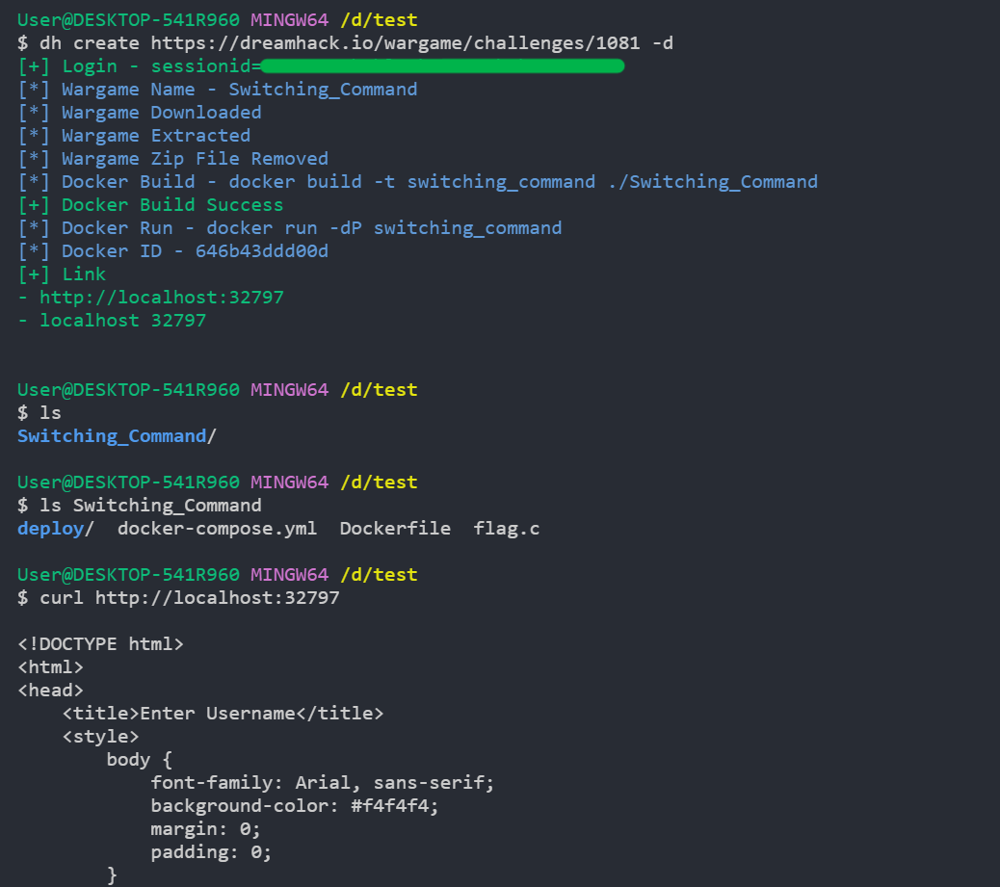

# dreamhack-cli-plus

Extended fork of [dreamhack-cli](https://github.com/sihyeokpark/dreamhack-cli) with quality-of-life upgrades for users who log in via Google OAuth and want a smoother local pwn workflow.



## What's added

### Auth
- **Cookie-based auth (`--sessionid` / `--csrf`)** — for accounts that use Google OAuth (no email/password). The CLI uses your browser session directly, no `User.login()` call.
- **Updated download flow** — uses the current dreamhack download API (`POST /api/v1/wargame/challenges/<id>/download/`) instead of the deprecated `wargameJSON.public` field.

### New commands
- **`dh vm`** — manage dreamhack-hosted VM instances (create / get / delete) without opening the web UI. `-c` and `-g` also auto-patch `solve/solve.py`'s `HOST, PORT = ...` line to the running VM's address.
- **`dh submit`** — submit a flag from the terminal.

### `dh create` upgrades
- **`-c / --continue`** — skip download/extract and reuse the existing wargame directory (preserves manual edits like Dockerfile tweaks, in-progress exploit code, etc.).
- **`-l / --libc`** — extract `libc.so.6` and `ld-linux-*.so` out of the built challenge image into the wargame directory, ready for exploit dev.
- **Auto-chmod from Dockerfile** — after extraction, parses `ADD/COPY` and `RUN chmod` directives in the wargame's Dockerfile and applies the same permissions to local source files (e.g. `chall=550`, `flag=440`, `init.sh=700`). Falls back to `chmod 755` on any ELF if the Dockerfile has no chmods.
- **Auto-generates `solve/solve.py`** — pwntools boilerplate with `BINARY` and `PORT` auto-detected (from the first ELF in `deploy/` and the xinetd config). Skipped if `solve/` already exists.
- **Smarter docker run** — when the wargame Dockerfile lacks `EXPOSE` / `CMD` (common dreamhack pattern), automatically:
  - Detects the xinetd port from `<wargame>/deploy/*.xinetd` and adds `-p N:N`
  - Falls back to `/etc/init.sh` as the container command if `<wargame>/deploy/init.sh` exists
- **Auto-cleanup of stale containers** — before each run, removes any prior container from the same image OR holding the same port (catches stale containers from older image digests after rebuild).
- **Docker Compose v2** support (`docker compose` instead of legacy `docker-compose`).

## Install

```sh
git clone https://github.com/serize06/dreamhack-cli-plus.git
cd dreamhack-cli-plus
npm install
sudo npm link        # makes `dh` globally available
```

## Configure

### Option A — Google OAuth users (recommended)

1. Log in to dreamhack.io in your browser
2. Open DevTools → Application → Cookies → `https://dreamhack.io`
3. Copy `sessionid` and `csrf_token` values
4. Run:

```sh
dh config --sessionid=<sessionid> --csrf=<csrf_token>
```

`csrf_token` rarely refreshes (rotates only on login); `sessionid` is valid for ~1 week. Re-run `dh config` if you see auth errors.

### Option B — email/password

```sh
dh config --email=<email> --password=<password>
```

## Usage

```sh
dh create <link>                # download + auto-chmod + create solve/
dh create <link> -d             # ... + build/run docker
dh create <link> -d -l          # ... + extract libc/ld into wargame dir
dh create <link> -c -d          # skip download (continue), rebuild docker with edits

dh vm <link> -c                 # create hosted VM
dh vm <link> -g                 # show VM host:port
dh vm <link> -d                 # delete VM (frees instance time)

dh submit <link> --flag='DH{...}'

dh help
```

### What you get after `dh create <link>`

```
<Wargame Title>/
├── Dockerfile
├── deploy/
│   ├── chall            (chmod-ed per Dockerfile)
│   ├── flag
│   ├── init.sh
│   ├── pwn.xinetd
│   └── ...
└── solve/
    └── solve.py         (pwntools template, BINARY/PORT pre-filled)
```

Add `-d -l` and you also get `libc.so.6` + `ld-linux-*.so` in the wargame dir, plus a running container on the detected port.

## Notes

- `src/data/user.json` stores credentials in plaintext (same as upstream). Don't commit it — the `.gitignore` excludes it.
- Auto-detection heuristics target the common dreamhack pwn challenge layout (`deploy/*.xinetd`, `deploy/init.sh`, ELF binary in `deploy/`). If a challenge breaks them, edit the Dockerfile in the wargame dir and use `dh create <link> -c -d` to rebuild with your edits.
- `solve/` is treated as user-owned: never overwritten on re-download, never recreated by `--continue`. The only thing `dh` rewrites in `solve.py` is the `HOST, PORT = ...` line (when a VM is created/queried). The rest of your exploit code is untouched.
- Local docker is fine for most challenges. For `needs_vm: true` challenges (heap challenges with `vm.overcommit_memory` requirements, etc.), prefer `dh vm`.

## License

MIT — see [LICENSE](LICENSE). Original work © 2024 EXON; this fork's additions © 2026 serize06.
